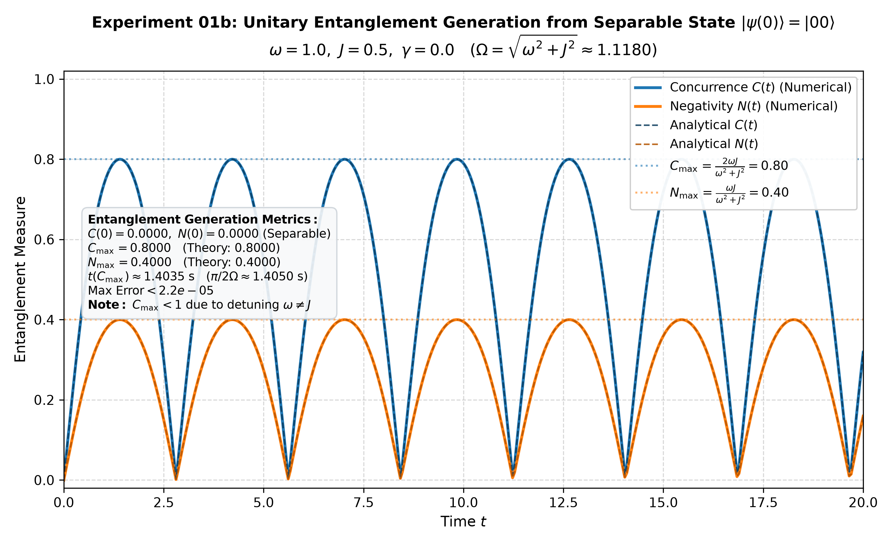
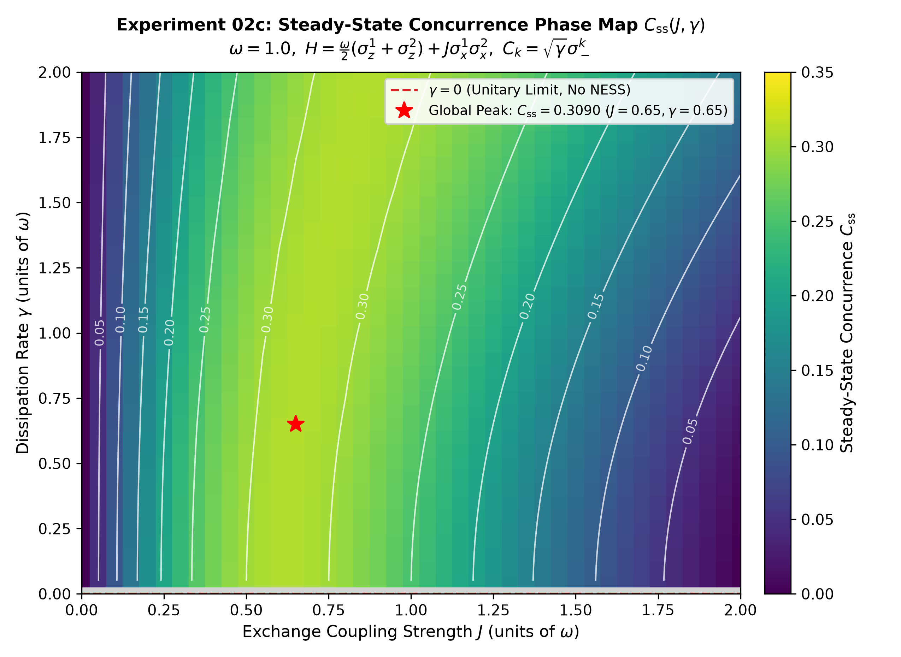
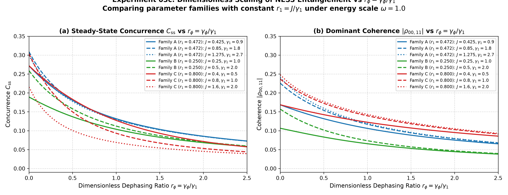
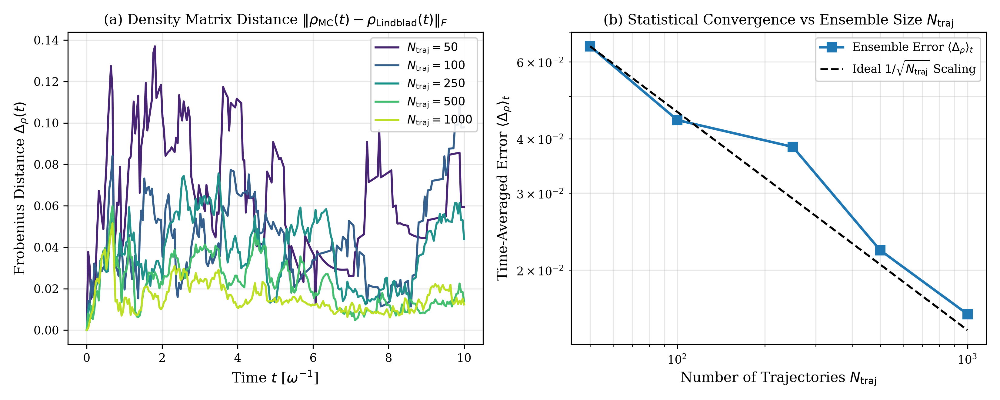
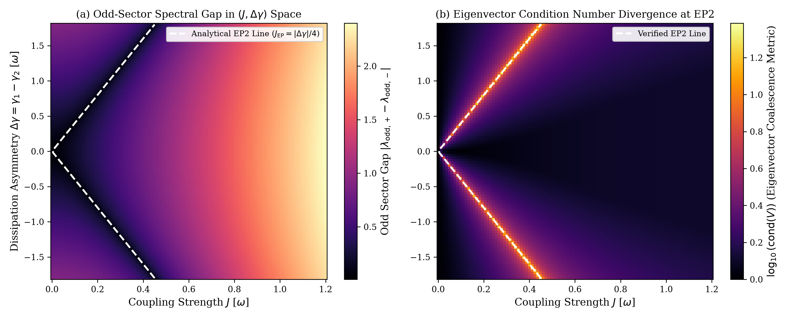
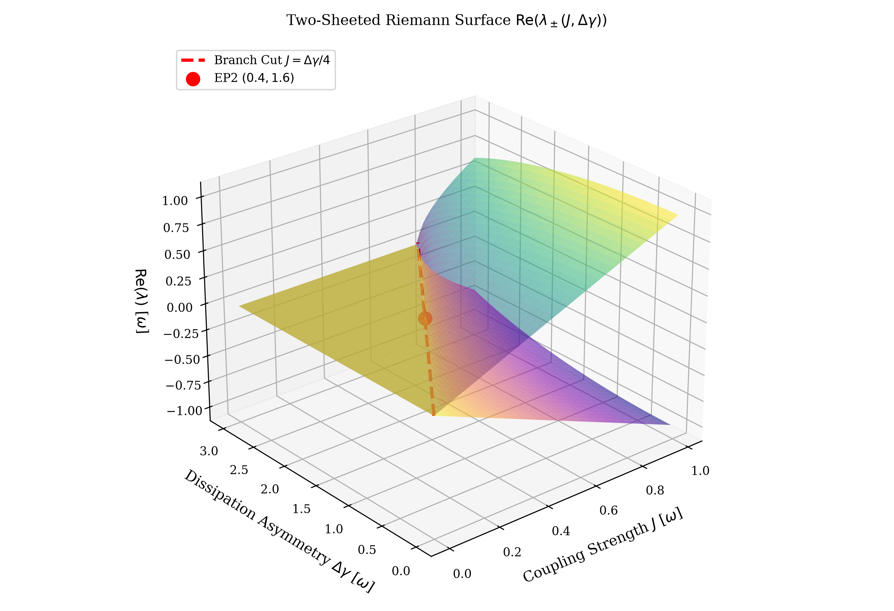
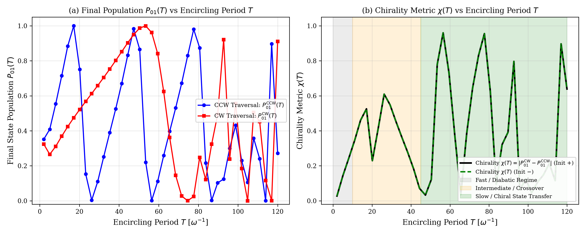
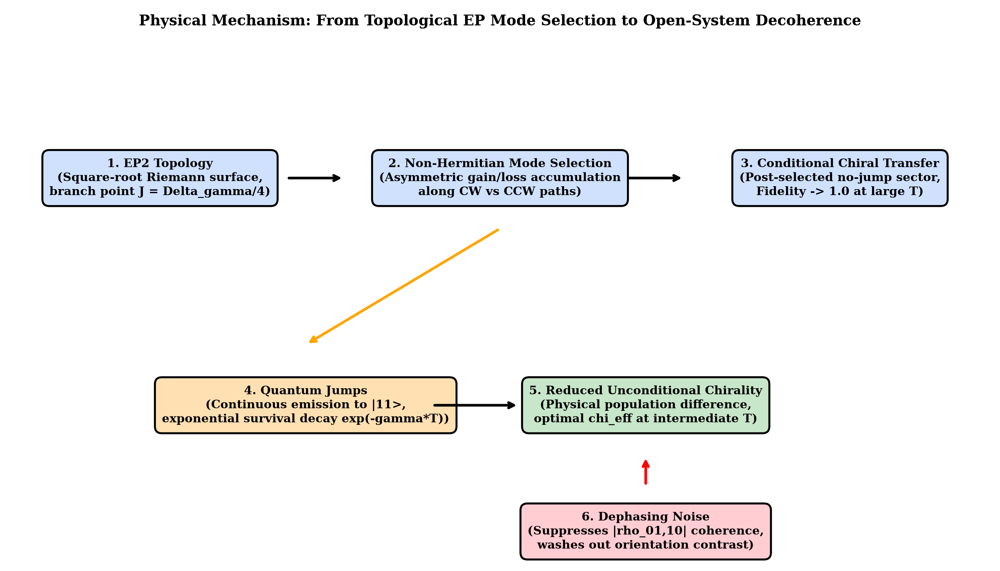

# Open Bipartite Spin Dynamics: Entanglement, Dissipation, Non-Hermitian Dynamics, and Exceptional Points

[](https://www.python.org/)
[](https://qutip.org/)
[]()
[]()

A comprehensive computational and analytical research framework investigating the nonequilibrium physics of two interacting spin- $1/2$ qubits across closed unitary, open dissipative, and effective non-Hermitian dynamical regimes. The repository implements exact Lindblad master-equation solvers, stochastic Monte-Carlo quantum trajectories, non-Hermitian spectral topology mapping, and dynamic parameter-space encircling of second-order exceptional points (EP2).

---

## Table of Contents

1. [Scientific Motivation & Research Progression](#1-scientific-motivation--research-progression)
2. [Physical Model](#2-physical-model)
3. [Open Quantum System Framework](#3-open-quantum-system-framework)
4. [Effective Non-Hermitian Framework](#4-effective-non-hermitian-framework)
5. [Research Architecture](#5-research-architecture)
6. [Experimental Roadmap](#6-experimental-roadmap)
7. [Detailed Experiment Summaries](#7-detailed-experiment-summaries)
8. [Key Physical Findings](#8-key-physical-findings)
9. [Representative Results](#9-representative-results)
10. [Repository Structure](#10-repository-structure)
11. [Installation & Setup](#11-installation--setup)
12. [Running Experiments](#12-running-experiments)
13. [Reproducibility & Validation](#13-reproducibility--validation)
14. [Future Research Directions](#14-future-research-directions)

---

## 1. Scientific Motivation & Research Progression

Quantum information processing and open quantum systems research rely on understanding how coherent unitary interactions compete with environmental decoherence. In closed systems, bipartite exchange interactions generate maximal quantum entanglement. In realistic physical implementations—such as superconducting circuits, trapped ions, and nitrogen-vacancy centers—spontaneous emission (amplitude damping) and phase noise (pure dephasing) degrade quantum coherence.

However, open systems are not merely noisy versions of closed systems. When dissipation is structured, the interplay between coherent coupling and local relaxation can:
1. **Stabilize Entangled Non-Equilibrium Steady States (NESS):** Counter-intuitively generating persistent entanglement without continuous external control.
2. **Induce Effective Non-Hermitian Dynamics:** Governing conditional no-jump quantum trajectories.
3. **Generate Exceptional Points (EPs):** Spectral singularities where eigenvalues and their corresponding eigenvectors simultaneously coalesce.
4. **Enable Direction-Dependent (Chiral) State Transfer:** Breaking adiabatic symmetry when parameters dynamically encircle an exceptional point.

This repository systematically charts this physical hierarchy from foundational unitary dynamics to full master-equation robustness of topological EP encircling.

---

## 2. Physical Model

The system consists of two coupled two-level systems (qubits/spins) governed by the transverse Ising Hamiltonian:

$$
H = \frac{\omega}{2}\left(\sigma_z^{(1)} + \sigma_z^{(2)}\right) + J \sigma_x^{(1)}\sigma_x^{(2)}
$$

where:
- $\omega$: Local energy splitting (qubit transition frequency).
- $J$: Coherent transverse coupling strength.
- $\sigma_{x,y,z}^{(i)}$: Standard Pauli operators acting on qubit $i \in \{1, 2\}$.

### Computational Basis & Parity Symmetry
The 4-dimensional Hilbert space $\mathcal{H} = \mathbb{C}^2 \otimes \mathbb{C}^2$ is spanned by the ordered computational basis:
- $|00\rangle \equiv |\uparrow\uparrow\rangle$ (index 0, double excited state)
- $|01\rangle \equiv |\uparrow\downarrow\rangle$ (index 1, spin 1 excited, spin 2 ground)
- $|10\rangle \equiv |\downarrow\uparrow\rangle$ (index 2, spin 1 ground, spin 2 excited)
- $|11\rangle \equiv |\downarrow\downarrow\rangle$ (index 3, ground state)

The Hamiltonian commutes with the total parity operator $\Pi = \sigma_z^{(1)}\sigma_z^{(2)}$ ($[H, \Pi] = 0$), decomposing $\mathcal{H}$ into two invariant $2 \times 2$ parity blocks:
- **Even Parity Sector ($\Pi = +1$):** $\text{span}\{|00\rangle, |11\rangle\}$
- **Odd Parity Sector ($\Pi = -1$):** $\text{span}\{|01\rangle, |10\rangle\}$

---

## 3. Open Quantum System Framework

Coupling to Markovian reservoirs is described by the Gorini-Kossakowski-Sudarshan-Lindblad (GKSL) master equation:

$$
\frac{d\rho}{dt} = \mathcal{L}[\rho] = -i[H(t), \rho] + \sum_k \mathcal{D}[L_k(t)]\rho
$$

with the Lindblad dissipator:

$$
\mathcal{D}[L]\rho = L \rho L^\dagger - \frac{1}{2}\left\{ L^\dagger L, \rho \right\}
$$

### Dissipation & Noise Channels
1. **Local Amplitude Damping (Spontaneous Emission):**
   $$L_1 = \sqrt{\gamma_1}\sigma_-^{(1)},\quad L_2 = \sqrt{\gamma_2}\sigma_-^{(2)}$$
   where $\sigma_- = |1\rangle\langle 0|$ is the lowering operator. In general asymmetric configurations, $\gamma_1 \neq \gamma_2$, with mean decay rate $\bar{\gamma} = (\gamma_1 + \gamma_2)/2$ and asymmetry $\Delta\gamma = \gamma_1 - \gamma_2$.
2. **Local Pure Dephasing (Phase Noise):**
   $$L_{\phi,1} = \sqrt{\frac{\gamma_\phi}{2}}\sigma_z^{(1)},\quad L_{\phi,2} = \sqrt{\frac{\gamma_\phi}{2}}\sigma_z^{(2)}$$

---

## 4. Effective Non-Hermitian Framework

The master equation can be partitioned into a conditional continuous drift and discrete stochastic quantum jumps:

$$
\frac{d\rho}{dt} = -i\left( H_{\text{eff}}\rho - \rho H_{\text{eff}}^\dagger \right) + \sum_k L_k \rho L_k^\dagger
$$

where the **effective non-Hermitian Hamiltonian** is defined as:

$$
H_{\text{eff}} = H - \frac{i}{2}\sum_k L_k^\dagger L_k
$$

### Key Physical Distinctions
- **Full Lindblad Evolution:** Unconditional, trace-preserving ($\text{Tr}(\rho)=1$) density matrix dynamics averaging over all quantum jump histories.
- **Conditional No-Jump Dynamics:** Sub-ensemble evolution conditioned on detecting zero emission events:
  $$i\frac{d|\psi(t)\rangle}{dt} = H_{\text{eff}}(t)|\psi(t)\rangle$$
  The norm decays as $\langle\psi(t)|\psi(t)\rangle = P_{\text{no-jump}}(t) \le 1$. State normalization yields $|\tilde{\psi}(t)\rangle = |\psi(t)\rangle / \sqrt{\langle\psi(t)|\psi(t)\rangle}$.
- **Spectrum of $H_{\text{eff}}$:** Complex eigenvalues $\lambda_n = E_n - i\Gamma_n/2$ determine coherent oscillation frequencies $E_n$ and state-dependent decay rates $\Gamma_n$.

---

## 5. Research Architecture

```
Closed Quantum Dynamics
   ├── Exp 01: Unitary Bell state dynamics
   └── Exp 01b: Unitary entanglement generation
        │
        ▼
Dissipative Open-System Dynamics
   ├── Exp 02a: Pure amplitude damping & decay
   ├── Exp 02b: Coherent-dissipative competition
   └── Exp 02c: Steady-state entanglement phase map
        │
        ▼
Decoherence and Noise Competition
   ├── Exp 03a: Pure dephasing baseline
   ├── Exp 03b: Mixed relaxation and dephasing
   └── Exp 03c: NESS mechanism & dimensionless scaling
        │
        ▼
Quantum Trajectories & Non-Hermitian Drift
   └── Exp 04: Stochastic unraveling & conditional no-jump dynamics
        │
        ▼
Spectral Non-Hermitian Physics & Exceptional Points
   ├── Exp 05: Asymmetric dissipation & EP2 discovery
   └── Exp 06a: Static EP2 topology & Riemann surface mapping
        │
        ▼
Dynamical Encircling & Robustness
   ├── Exp 06b: Chiral state transfer in no-jump dynamics
   └── Exp 06c: Full Lindblad master-equation robustness
```

---

## 6. Experimental Roadmap

| Experiment | Scientific Objective | Physical Regime | Key Physical Result | Script |
| :--- | :--- | :--- | :--- | :--- |
| **01** | Unitary Bell state dynamics | Closed system, $\gamma=0$ | Coherent oscillations of Concurrence and Negativity; invariant trace and purity. | [`01_unitary_entanglement.py`](experiments/01_unitary_entanglement.py) |
| **01b** | Entanglement generation | Closed system, init $\|00\rangle$ | $J$-driven generation of maximal entanglement with period $\pi/J$. | [`01b_unitary_entanglement_generation.py`](experiments/01b_unitary_entanglement_generation.py) |
| **02a** | Pure dissipative decay | Open system, $J=0, \gamma>0$ | Monotonic exponential entanglement decay with rate $2\gamma$; dark state $\|11\rangle$. | [`02a_pure_dissipative_entanglement.py`](experiments/02a_pure_dissipative_entanglement.py) |
| **02b** | Coherent-dissipative competition | Open system, $J>0, \gamma>0$ | Crossover from underdamped oscillatory decay to overdamped asymptotic state. | [`02b_coherent_dissipative_competition.py`](experiments/02b_coherent_dissipative_competition.py) |
| **02c** | Steady-state phase map | Asymptotic NESS, $(J, \gamma)$ | Discovery of an entangled NESS island with peak Concurrence $C_{\text{ss}} \approx 0.309$. | [`02c_steady_state_entanglement_phase_map.py`](experiments/02c_steady_state_entanglement_phase_map.py) |
| **03a** | Pure dephasing baseline | Open system, $\gamma_1=0, \gamma_\phi>0$ | Population-preserving phase coherence damping; asymptotic entanglement is zero. | [`03a_pure_dephasing_baseline.py`](experiments/03a_pure_dephasing_baseline.py) |
| **03b** | Mixed damping and dephasing | Open system, $\gamma_1>0, \gamma_\phi>0$ | Dephasing suppresses NESS entanglement; smooth crossover boundary mapped. | [`03b_combined_damping_dephasing.py`](experiments/03b_combined_damping_dephasing.py) |
| **03c** | NESS mechanism and scaling | Liouvillian spectral analysis | Analytical proof of NESS entanglement via X-state coherence; universal $(J/\gamma_1)$ scaling. | [`03c_physical_mechanism_scaling.py`](experiments/03c_physical_mechanism_scaling.py) |
| **04** | Quantum trajectories & $H_{\text{eff}}$ | Stochastic unraveling | $N_{\text{traj}} \ge 500$ trajectory average reconstructs master equation; no-jump norm decay. | [`04_effective_nonhermitian_trajectories.py`](experiments/04_effective_nonhermitian_trajectories.py) |
| **05** | Spectral non-Hermitian physics | Odd/even $H_{\text{eff}}$ blocks | Symmetric model has no EPs; asymmetric loss ($\gamma_1 \neq \gamma_2$) produces an EP2 at $J = \|\Delta\gamma\|/4$. | [`05_spectral_nonhermitian_physics.py`](experiments/05_spectral_nonhermitian_physics.py) |
| **06a** | Static EP2 topology | Parameter loops in $(J, \Delta\gamma)$ | $2\pi$ loop swaps eigenpairs ($\lambda_1 \leftrightarrow \lambda_2$); $4\pi$ loop restores identity on Riemann surface. | [`06a_static_ep_topology.py`](experiments/06a_static_ep_topology.py) |
| **06b** | Dynamic EP encircling | Time-dependent no-jump drift | Direction-dependent chiral state transfer; funnels all initial states to single mode with $\chi_{\max} = 0.96$. | [`06b_dynamic_ep_encircling.py`](experiments/06b_dynamic_ep_encircling.py) |
| **06c** | Full open-system robustness | Time-dependent Lindblad | Chirality survives quantum jumps; survival-weighted chirality peaks at $T \approx 19.4\,\omega^{-1}$. | [`06c_ep_encircling_open_system_robustness.py`](experiments/06c_ep_encircling_open_system_robustness.py) |

---

## 7. Detailed Experiment Summaries

### Experiment 01 & 01b: Closed Unitary Entanglement Dynamics
- **Exp 01:** Analyzed the closed-system evolution of an initial Bell state $|\Phi^+\rangle = (|00\rangle + |11\rangle)/\sqrt{2}$. Verified periodic revivals of Concurrence $C(t)$ and Negativity $N(t)$ with zero trace drift.
- **Exp 01b:** Initialized the separable product state $|00\rangle$. The transverse coupling $J\sigma_x^{(1)}\sigma_x^{(2)}$ drives coherent population transfer into $|11\rangle$, dynamically generating maximal bipartite entanglement ($C=1.0$) at $t = \pi / (4J)$ when $\omega = 0$.

### Experiment 02a–02c: Dissipative Dynamics & Entangled Steady States
- **Exp 02a:** Evaluated uncoupled qubits under local amplitude damping ($\gamma_1 = \gamma_2 > 0, J = 0$). Entanglement decays exponentially ($C(t) = C(0)e^{-2\gamma t}$), terminating at the unentangled ground state $|11\rangle$.
- **Exp 02b:** Introduced coherent coupling $J$ in the presence of amplitude damping $\gamma$. Discovered an underdamped-to-overdamped dynamical transition governed by the ratio $J/\gamma$.
- **Exp 02c:** Performed a systematic 2D parameter scan in the $(J/\omega, \gamma/\omega)$ space. Mapped the non-equilibrium steady state (NESS) and discovered an **entangled steady-state island** reaching $C_{\text{ss}} \approx 0.309$ near $J \approx 0.6\,\omega, \gamma \approx 0.6\,\omega$.

### Experiment 03a–03c: Dephasing Noise, Mechanisms, and Scaling
- **Exp 03a:** Isolated pure dephasing ($L_{\phi} = \sqrt{\gamma_\phi/2}\sigma_z$). Proved that dephasing damps off-diagonal coherence elements without modifying diagonal populations, destroying asymptotic entanglement ($C_{\text{ss}} = 0$).
- **Exp 03b:** Investigated simultaneous amplitude damping and dephasing. Demonstrated that dephasing systematically shrinks the entangled NESS domain.
- **Exp 03c:** Developed an analytical Liouvillian balance model. Proved via X-state concurrence decomposition ($C = 2\max(0, |\rho_{01,10}| - \sqrt{\rho_{00,00}\rho_{11,11}}, |\rho_{00,11}| - \sqrt{\rho_{01,01}\rho_{10,10}})$) that amplitude damping enables NESS entanglement by depleting the double-excited population $\rho_{00,00}$, whereas dephasing directly suppresses the off-diagonal coherence $|\rho_{01,10}|$. Established universal collapse under the dimensionless scaling parameter $J/\gamma_1$.

### Experiment 04: Quantum Trajectories and Effective Non-Hermitian Drift
- Formulated the stochastic Schrödinger equation (Monte-Carlo unraveling).
- Demonstrated that an ensemble of $N_{\text{traj}} \ge 500$ stochastic trajectories quantitatively reconstructs the Lindblad density matrix $\rho(t)$ with statistical error scaling as $\mathcal{O}(1/\sqrt{N_{\text{traj}}})$.
- Quantified the conditional no-jump survival probability $P_{\text{no-jump}}(t) = \exp(-\int_0^t \sum_k \langle L_k^\dagger L_k \rangle dt')$.

### Experiment 05: Spectral Non-Hermitian Physics and EP2 Discovery
- Decomposed $H_{\text{eff}}$ into independent $2 \times 2$ parity blocks.
- **Symmetric Loss ($\gamma_1 = \gamma_2$):** Proved analytically that the symmetric model possesses strictly real eigenvalue differences and no exceptional points for $J > 0$.
- **Asymmetric Loss ($\gamma_1 \neq \gamma_2$):** Discovered a second-order exceptional point (EP2) in the odd-parity single-excitation subspace $\text{span}\{|01\rangle, |10\rangle\}$:
  $$H_{\text{eff}}^{\text{odd}} = -i\frac{\gamma_1 + \gamma_2}{4}I + \begin{pmatrix} -i\frac{\Delta\gamma}{4} & J \\ J & +i\frac{\Delta\gamma}{4} \end{pmatrix}$$
  with eigenvalues $\lambda_\pm = -i\frac{\gamma_1+\gamma_2}{4} \pm \sqrt{J^2 - (\Delta\gamma/4)^2}$. The exact EP2 condition is:
  $$J_{\text{EP}} = \frac{|\gamma_1 - \gamma_2|}{4} = \frac{|\Delta\gamma|}{4}$$

### Experiment 06a: Static EP2 Topology and Riemann Surfaces
- Evaluated parameter loops $\mathcal{C}(\theta) = (J(\theta), \Delta\gamma(\theta))$ in the complex eigenvalue manifold.
- Confirmed the square-root branch point topology ($\sqrt{z}$):
  - Encircling the EP once ($\Delta\theta = 2\pi$) cyclically permutes the eigenvalues: $\lambda_1 \leftrightarrow \lambda_2$.
  - Encircling the EP twice ($\Delta\theta = 4\pi$) returns the system to the identity: $\lambda_j \to \lambda_j$.
  - Non-encircling control loops exhibit zero eigenvalue permutation.

### Experiment 06b: Dynamical EP Encircling and Chiral State Transfer
- Integrated the time-dependent non-Hermitian Schrödinger equation $i\partial_t |\psi(t)\rangle = H_{\text{eff}}^{\text{odd}}(t)|\psi(t)\rangle$ along counter-clockwise (CCW) and clockwise (CW) parameter loops.
- **Asymmetric Mode Amplification:** Demonstrated that non-Hermitian dynamical evolution breaks adiabatic symmetry. Rather than state permutation, dynamic encircling exhibits **chiral state funneling**:
  - CCW encircling funnels **all** initial states into mode $+$ ($F_{+ \to +} = 1.0, F_{- \to +} = 1.0$).
  - CW encircling funnels **all** initial states into mode $-$ ($F_{+ \to -} = 1.0, F_{- \to -} = 1.0$).
- Discovered maximum population chirality $\chi_{\max} = 0.9598$ at period $T = 56.5\,\omega^{-1}$.

### Experiment 06c: Robustness Under Full Open-System Dynamics
- Integrated the complete 4-level time-dependent Lindblad master equation $\dot{\rho} = -i[H(t), \rho] + \sum_k \mathcal{D}[L_k(t)]\rho$.
- Demonstrated that quantum jumps continuously transfer population from $\{|01\rangle, |10\rangle\}$ to the ground state $|11\rangle$.
- Formulated the **survival-weighted chirality** $\chi_{\text{eff}}(T) = \chi(T) \cdot S_{\text{odd}}(T)$, discovering a well-defined physical optimal operating window ($8\,\omega^{-1} \le T \le 30\,\omega^{-1}$) peaking at **$T = 19.4\,\omega^{-1}$** with $\chi_{\text{eff}} = 1.026 \times 10^{-3}$.
- Proved that pure dephasing induces a smooth crossover suppression of odd-sector coherence $|\rho_{01,10}(T)|$.

---

## 8. Key Physical Findings

1. **Dissipative Entanglement Stabilization:** Amplitude damping does not merely destroy entanglement; when balanced against coherent exchange $J$, it continuously purges the separable double-excited component $\rho_{00,00}$, sustaining an entangled NESS ($C_{\text{ss}} \approx 0.309$).
2. **Dephasing-Induced Coherence Destruction:** Pure dephasing specifically attacks off-diagonal density matrix coherences without affecting state populations, extinguishing NESS entanglement via a smooth crossover.
3. **Symmetry Requirement for Exceptional Points:** Symmetric dissipation ($\gamma_1 = \gamma_2$) cannot induce exceptional points in the transverse Ising model. Introducing asymmetric dissipation ($\Delta\gamma = \gamma_1 - \gamma_2 \neq 0$) breaks chiral symmetry and generates an EP2 at $J = |\Delta\gamma|/4$.
4. **Static Topology vs Dynamic Funneling:** While static parameter continuation produces a cyclic state swap ($\lambda_1 \leftrightarrow \lambda_2$) after $2\pi$, real-time dynamical encircling exhibits non-adiabatic chiral mode selection due to differential exponential amplification $\sim \exp(\int \text{Im}(\lambda) dt)$.
5. **Open-System Survival Trade-Off:** In full Lindblad open systems, the observability of EP chirality is governed by the survival-weighted metric $\chi_{\text{eff}}(T) = \chi(T) \cdot S_{\text{odd}}(T)$, balancing non-adiabatic fidelity at short $T$ against dissipative ground-state depletion at long $T$.

---

## 9. Representative Results

### Closed Dynamics & Entangled Steady States
| Unitary Entanglement Generation (Exp 01b) | Steady-State Concurrence Phase Map (Exp 02c) |
| :---: | :---: |
|  |  |

### NESS Scaling & Quantum Trajectories
| Dimensionless Scaling & Robustness (Exp 03c) | Trajectory Ensemble Convergence (Exp 04) |
| :---: | :---: |
|  |  |

### Exceptional Point Physics & Chiral Encircling
| Asymmetric Dissipation EP2 Map (Exp 05) | Real Eigenvalue Riemann Surface (Exp 06a) |
| :---: | :---: |
|  |  |

| Conditional Chiral State Transfer (Exp 06b) | Full Open-System Mechanism Flowchart (Exp 06c) |
| :---: | :---: |
|  |  |

---

## 10. Repository Structure

```
bipartit-open-spin/
├── pyproject.toml              # Build configuration and dependency specifications
├── README.md                   # Project documentation and research report
├── src/
│   └── bipartit_open_spin/     # Modular quantum dynamics core package
│       ├── __init__.py         # Public API exports
│       ├── config.py           # SimulationConfig and ModelParams dataclasses
│       ├── analysis/           # Entanglement, concurrence, negativity, and spectra
│       │   ├── __init__.py
│       │   ├── entanglement.py # Concurrence, Negativity, X-state decomposition
│       │   └── spectrum.py     # Complex eigenvalues, biorthogonal vectors, EP detection
│       ├── core/               # Hilbert space basis, states, and Pauli operators
│       │   ├── __init__.py
│       │   ├── operators.py    # Pauli matrices, lowering operators, identity
│       │   └── states.py       # Density matrices, Bell states, computational basis
│       ├── dynamics/           # Master equation, non-Hermitian drift, trajectories
│       │   ├── __init__.py
│       │   ├── dissipation.py  # Lindblad collapse operators, jump rates, Liouvillians
│       │   ├── hamiltonian.py  # Bipartite and effective non-Hermitian Hamiltonians
│       │   └── simulation.py   # mesolve, mcsolve, DOP853 ODE integration
│       └── validation/         # Physical state verification and sanity checks
│           ├── __init__.py
│           └── diagnostics.py  # Trace, Hermiticity, and positive semi-definiteness
├── experiments/                # Executable experiment scripts (01 to 06c)
│   ├── 01_unitary_entanglement.py
│   ├── 01b_unitary_entanglement_generation.py
│   ├── 02a_pure_dissipative_entanglement.py
│   ├── 02b_coherent_dissipative_competition.py
│   ├── 02c_steady_state_entanglement_phase_map.py
│   ├── 03a_pure_dephasing_baseline.py
│   ├── 03b_combined_damping_dephasing.py
│   ├── 03c_physical_mechanism_scaling.py
│   ├── 04_effective_nonhermitian_trajectories.py
│   ├── 05_spectral_nonhermitian_physics.py
│   ├── 06a_static_ep_topology.py
│   ├── 06b_dynamic_ep_encircling.py
│   └── 06c_ep_encircling_open_system_robustness.py
├── tests/                      # Automated unit test suite (64 tests)
│   ├── test_core.py
│   ├── test_dynamics.py
│   ├── test_entanglement.py
│   ├── test_hamiltonian.py
│   ├── test_lindblad_encircling.py
│   ├── test_mechanism.py
│   ├── test_nonhermitian.py
│   ├── test_operators.py
│   ├── test_spectrum.py
│   ├── test_states.py
│   ├── test_topology.py
│   └── test_validation.py
└── results/
    ├── data/                   # Compressed NumPy (.npz) numerical archives
    └── figures/                # High-resolution (300 DPI) publication figures
```

---

## 11. Installation & Setup

This repository uses [`uv`](https://github.com/astral-sh/uv) for fast, deterministic Python environment management.

### Prerequisites
- Python $\ge 3.13$
- Git

### Installation Steps

1. **Clone the repository:**
   ```bash
   git clone https://github.com/farhanradefa/bipartit-open-spin.git
   cd bipartit-open-spin
   ```

2. **Set up the virtual environment and install dependencies:**
   ```bash
   # Using uv (recommended)
   uv sync

   # Or using standard pip
   python -m venv .venv
   source .venv/bin/activate  # On Windows: .venv\Scripts\activate
   pip install -e .
   ```

### Core Dependencies
- `qutip >= 5.3.1` (Quantum Toolbox in Python)
- `numpy >= 2.5.2` (Numerical array computing)
- `scipy >= 1.18.1` (High-order ODE solvers and matrix algebra)
- `matplotlib >= 3.11.1` (Publication figure rendering)
- `pandas >= 3.0.5` (Structured parameter scan management)

---

## 12. Running Experiments

All experiment scripts can be executed directly from the project root.

```bash
# Run closed-system unitary dynamics
uv run python experiments/01_unitary_entanglement.py
uv run python experiments/01b_unitary_entanglement_generation.py

# Run open-system dissipative competition & steady-state maps
uv run python experiments/02a_pure_dissipative_entanglement.py
uv run python experiments/02b_coherent_dissipative_competition.py
uv run python experiments/02c_steady_state_entanglement_phase_map.py

# Run dephasing noise & analytical mechanism analyses
uv run python experiments/03a_pure_dephasing_baseline.py
uv run python experiments/03b_combined_damping_dephasing.py
uv run python experiments/03c_physical_mechanism_scaling.py

# Run quantum trajectories & non-Hermitian physics
uv run python experiments/04_effective_nonhermitian_trajectories.py
uv run python experiments/05_spectral_nonhermitian_physics.py

# Run EP topological mapping & dynamic encircling
uv run python experiments/06a_static_ep_topology.py
uv run python experiments/06b_dynamic_ep_encircling.py
uv run python experiments/06c_ep_encircling_open_system_robustness.py
```

Generated datasets are saved to `results/data/*.npz` and high-resolution publication figures are output to `results/figures/*.png`.

---

## 13. Reproducibility & Validation

The codebase enforces strict physical sanity checks and numerical validation across all modules:

### Diagnostic Checks
- **Trace Preservation:** Checks that $|\text{Tr}(\rho) - 1.0| < 10^{-6}$ for all density matrices.
- **Hermiticity:** Verifies $\|\rho - \rho^\dagger\|_\infty < 10^{-6}$.
- **Positive Semi-Definiteness:** Computes eigenvalues via `np.linalg.eigvalsh` to verify $\lambda_{\min}(\rho) \ge -10^{-6}$.
- **Positivity of Decay Rates:** Ensures $\gamma_1(t) \ge 0$ and $\gamma_2(t) \ge 0$ throughout parameter loops.

### Running the Test Suite
The repository includes 64 automated unit tests covering operator algebra, state validation, Liouvillian decomposition, biorthogonal eigenvectors, and EP branch tracking:

```bash
uv run python -m unittest discover -s tests -p "test_*.py" -v
```

---

## 14. Future Research Directions

1. **Continuous Repumping & Chiral NESS Engines:** Investigating active incoherent or coherent repumping ($|11\rangle \to |00\rangle$) to continuously replenish the odd sector and stabilize a stationary chiral quantum engine.
2. **Topological Berry & Geometric Phases:** Computing non-Abelian holonomies and geometric phases accumulated during multi-mode non-Hermitian cyclic transport.
3. **Non-Markovian Structured Reservoirs:** Extending the bath coupling beyond Lindblad master equations to examine memory kernels and colored noise effects on EP stability.
4. **Higher-Order Spin Networks ($N \ge 3$):** Scaling to multi-qubit topologies exhibiting third-order ($EP3$) and higher-order exceptional surfaces.
5. **Experimental Implementation Mapping:** Formulating exact pulse sequences and parameter schedules tailored for circuit QED and trapped-ion quantum simulators.

---

## License

This project is licensed under the MIT License — see the repository files for details.
